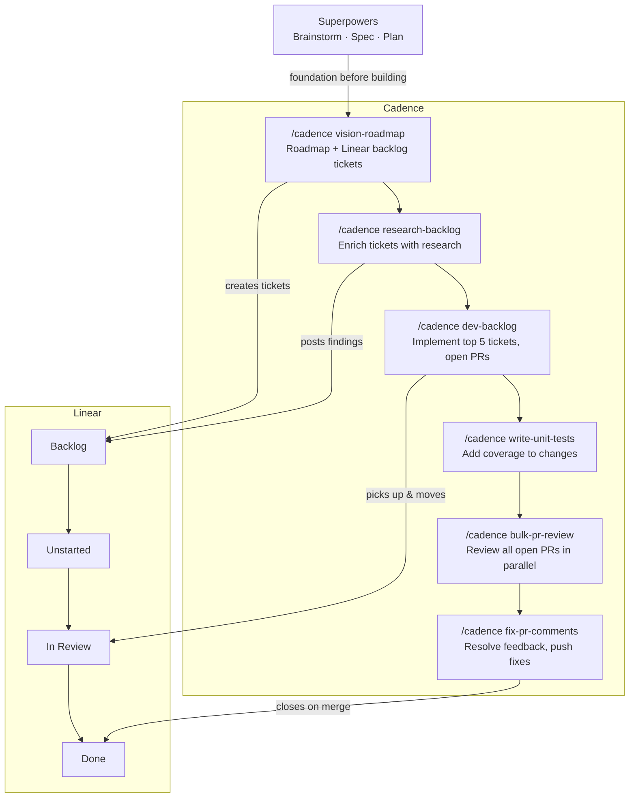

# cadence

A coordinated suite of agent skills for the full development lifecycle.

> **Quick start:** Install the cadence skill into your agent harness, then run `/cadence <sub-command>`.

---

## Pair With Superpowers

Cadence is purpose-built for bulk execution and scheduled automation. Before you start building, pair it with **[Superpowers](https://github.com/obra/superpowers)** — a methodology toolkit that ensures your agent approaches problems the right way from the start.

**Before any project, run the brainstorming skill from Superpowers.** It steps your agent back from the keyboard, teases out a real spec, and produces an implementation plan grounded in YAGNI and TDD — before a single line of code is written. That's the right foundation for cadence to execute against.

The split of responsibility is clean:

- **Superpowers** — _how_ to think: brainstorm, spec, plan, design
- **Cadence** — _how_ to execute at scale: bulk implementation, scheduled cron runs, PR review loops

Use Superpowers to decide what to build. Use cadence to build it, review it, and ship it — automatically, on a schedule, without babysitting.

---

## How It All Fits Together



---

## Why

Cadence covers the full cycle: research, ticket enrichment, implementation, test coverage, PR review, and comment resolution. Each skill runs as a bulk pass, processing your entire backlog or PR queue in one shot.

Schedule the loop and it runs without you. Research new tickets every morning. Implement five every night. Review open PRs each afternoon. Fix review feedback before you start work.

The handoffs stay clean: research before implementation, tests before review, comments resolved before merge. Build something large without losing track of where you are.

---

## What's Included

### The Skill

One skill, six sub-commands. Invoke as `/cadence <sub-command>`.

### Sub-commands

| Sub-command | What it does |
|---|---|
| `vision-roadmap` | Read the repo, ask 7 clarifying questions, produce a strategic roadmap doc, create Linear backlog tickets via GraphQL |
| `research-backlog` | Fetch all backlog tickets, dispatch parallel research agents, post structured findings as comments |
| `dev-backlog` | Pull up to 5 Todo tickets by priority, implement each on its own branch, open PRs targeting dev, move tickets to In Review |
| `write-unit-tests` | Discover test framework from codebase, identify coverage gaps from git diff, write pattern-matched tests |
| `fix-pr-comments` | Find all open PRs with CHANGES_REQUESTED or unresolved threads, fix every issue, push, reply to threads with commit SHA |
| `bulk-pr-review` | Map PR dependency layers, dispatch parallel review subagents per layer, post APPROVE / REQUEST CHANGES / BLOCKED-CI verdicts to GitHub |

---

## Usage

```
/cadence vision-roadmap
/cadence research-backlog
/cadence dev-backlog
/cadence write-unit-tests
/cadence fix-pr-comments
/cadence bulk-pr-review
```

Run `/cadence` with no sub-command to see the full list.

---

## Designed Workflow

The sub-commands form a full SDLC loop:

```
vision-roadmap      # What should we build?
      |
research-backlog    # What do we need to know before building?
      |
dev-backlog         # Build it.
      |
write-unit-tests    # Cover it.
      |
bulk-pr-review      # Review everything in flight.
      |
fix-pr-comments     # Close the loop on review feedback.
```

### Run it on a schedule

Each sub-command is stateless and idempotent. Running one twice leaves no duplicate work, so the whole loop is safe to schedule.

Wire it into cron directly, or use your harness's built-in scheduler if it has one:

```
# Enrich new backlog tickets every morning
0 8 * * 1-5   /cadence research-backlog

# Implement up to 5 tickets every weeknight
0 21 * * 1-5  /cadence dev-backlog

# Review all open PRs each afternoon
0 14 * * 1-5  /cadence bulk-pr-review

# Fix review comments before standup
0 9 * * 1-5   /cadence fix-pr-comments
```

`research-backlog` skips tickets it has already commented on. `dev-backlog` only picks up unstarted tickets. `fix-pr-comments` only touches PRs with open feedback.

---

## Installation

Copy the `skills/cadence` folder into your agent's skills directory.

**Claude Code:**

```bash
cp -r skills/cadence ~/.claude/skills/
```

**From this repo:**

```bash
git clone https://github.com/drewdoebereiner/cadence.git
cp -r cadence/skills/cadence <your-agent-skills-dir>/
```

The destination path varies by harness — check your agent's documentation for where it loads skills from.

---

## Why Linear

Three of the six sub-commands read and write Linear. Its GraphQL API is clean and well-documented. Ticket states (backlog, unstarted, in review) map directly to the stages cadence moves work through. Comment threads persist between agent runs, so research findings are already on the ticket when the implementer picks it up. For agents running on a schedule, that combination means full programmatic control with no UI work required.

Linear was built with developer tooling in mind. That shows in the API. It's why cadence uses it rather than a more generic project management tool.

---

## Requirements

Environment variables required per sub-command:

| Sub-command | Requires |
|---|---|
| `vision-roadmap` | `LINEAR_API_KEY` |
| `research-backlog` | `LINEAR_API_KEY` |
| `dev-backlog` | `LINEAR_API_KEY`, `gh` CLI authenticated |
| `write-unit-tests` | none |
| `fix-pr-comments` | `gh` CLI authenticated |
| `bulk-pr-review` | `gh` CLI authenticated |

---

## Supported Harnesses

Cadence is harness-agnostic. The skills are plain markdown files — any agent that can load and execute skills can run cadence.

- Claude Code
- Cursor
- Gemini CLI
- OpenAI Codex CLI
- Any agent that supports skill or plugin files

---

## License

MIT
